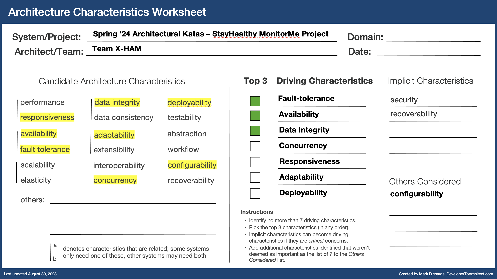

# Architecture Characteristics

- Architecture Characteristics discussed during our conversations:

| Architecture Characteristic | Reason to select | Driving Characteristic | Top 3 |
| --- | --- | --- | --- |
| Responsiveness | The system has to be able to send data to the Monitoring station within 1 second | Yes | |
| Availability | Since we're dealing with a system that sends vitals information to a nurse and alert to those same nurses and other clinicians, the system needs to be as available as possible in order to ensure that patient data makes its way to the appropriate individual | Yes | Yes |
| Fault Tolerance | The system needs to be able to deal with certain areas ceasing to function while not affecting other areas, ie a specific vitals device being down without taking down other vitals devices ability to continue being processed | Yes | Yes |
| Data Integrity | Medical data needs to be correct in order for nurses/clinicians to properly care for their patient.  MonitorMe requires the data to be correct to successfully analyze and alert. | Yes | Yes |
| Adaptability | The system does need to be able to accept new Vitals devices in the system and so from monitoring to analyzing/alerting, the system needs to be able to adapt to new vitals devices over time | Yes | |
| Concurrency | Analyzing and Alerting are two areas of the system that benefit from concurrency, so that events can be processed properly for each of the vitals device types along with ensuring they are alerting properly in order | Yes | |
| Deployability | Although the footprint is small within the on-premise solution for a specific customer, deployability is an important factor for StayHealthy in order to allow for multiple customers to be deployed.  This reduces the amount of work a StayHealth team will need to deploy a new implementation.  This also helps with potential upgrades of the system as new features are developed and rolled out. | Yes | |
| Configurability | Even though the majority of the components of the StayHealth system can be "hard-wired" to point to other components (based on the [Clarifications](../1.Background-and-Requirements/1.c-Clarifications.md) ) there are many components of the system that would benefit of having configurability to ensure a customer has control of how their system is implemented (ie, device to monitor flow, ways to analyze vitals information, where to send alerts, etc.) | | |

- Implicit Architectural Characteristics of the system:

| Architecture Characteristic | Reason to select |
| --- | --- |
| Security | Dealing with medical data always has risks that should be dealt with from a security perspective.  Further, tying security mechanisms to customer security mechanisms is also a consideration on why security is an implicit archtiectural characteristic |
| Recoverability | Healthcare systems need to be resilient to not only partial issues with the system but also complete failures to minimize the amount of time patients information is not available to clinical staff |

