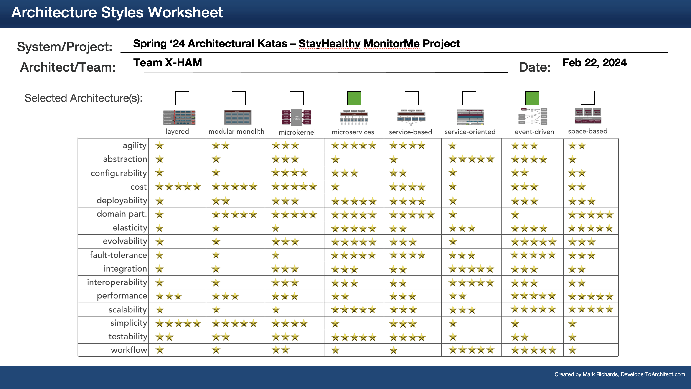

# Architecture Styles

Architectural Styles chosen for the StayHealth MonitorMe system:
| Style | Reason |
| --- | --- |
| Microservices | Gives us the greatest ability to meet the top 3 driving characteristics while maintaining the non-functional requirements centered around the speed of several aspects of our overall system |
| Event-driven | Although not guaranteeing speed for most of our system (see microservices above), adding event-driven pieces into our overall architecture gives us those characteristics around adaptability, fault-tolerance and recoverability for certain parts of the architecture |

