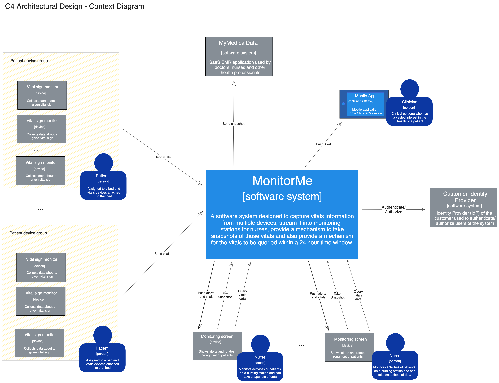

# Understanding the problem

MonitorMe is an on-prem system that integrates with several other on-prem and
cloud systems.

- *Vital Sign Devices* - These are devices that are connected to the MonitorMe
  system and send vital sign data to the system.  These devices can be
  connected to the MonitorMe system via a network connection or a direct
  connection to the MonitorMe system.
- *Monitoring Screen* - This is a screen that is used by a nurse to monitor
  the vital sign data that is being sent to the MonitorMe system.  The
  Monitoring Screen is a web application that is used to display the vital
  sign data that is being sent to the MonitorMe system. The Monitoring Screen
  can view vital sign feeds for up to 20 patients, can request queries of
  the past 24 hours of vital sign data, and can request a snapshot be sent to
  MyMedicalData. Additionally, this monitoring screen can receive alerts from
  the MonitorMe system.
- *MyMedicalData* - This is a SAAS product offered by StayHealthy, the same
  company that will offer MonitorMe. MyMedicalData will store snapshots of vital
  sign data for a given bed and associate it with a patient's medical record
  using a mapping that's done in MyMedicalData.
- *Mobile App* - This is a mobile application that is used by clinicians who
  need to receive alerts when a patient's vital signs reach an alert state.

## Context Diagram

We used C4 to model the problem space and create the solution for MonitorMe
starting with the Context diagram below.

