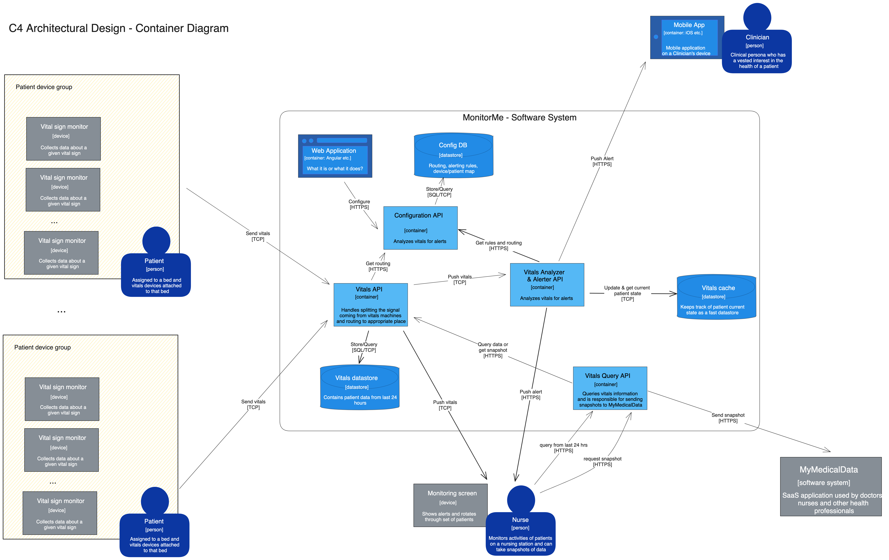

# Our Solution

Our solution consists of a network of microservices that communicate with each
other through different means. The microservices are deployed in Kubernetes. The
following diagram shows the architecture of the system:

The system is composed of the following microservices:

- **Vitals Reader**: This service reads the vitals from the patient's monitor
  and sends them to the Vitals Analyzer. The Vitals Reader receives the vitals
  from the patient's monitor through a TCP connection. The Vitals Reader then
  sends the vitals to the Vitals Analyzer through a TCP connection. It also
  sends the vitals to the *Vitals Datastore* and to a kafka topic that will be
  read by the *Vitals Analyzer*. This is further explored in [Vitals Reader
  Deep Dive](4.c-Device-Reader-Deep-Dive.md).
- **Vitals Analyzer**: This service receives the vitals from the *Vitals Reader*
  and analyzes them to determine if the patient needs to be alerted. The Vitals
  Analyzer receives the vitals from the *Vitals Reader* through a TCP
  connection. It also receives the vitals from the *Vitals Datastore* and from
  a kafka topic that contains the vitals. The Vitals Analyzer then sends the
  alerts to the *Vitals Alerter* through an HTTP request. This is further
  explored in [Vitals Analyzer Deep Dive](4.d-Vitals-Analyzer-Deep-Dive.md).
- **Vitals Alerter**: This service receives the alerts from the *Vitals
  Analyzer* and sends them to the nurse's station and to the mobile app. The
  *Vitals Alerter* receives the alerts from the *Vitals Analyzer* through an
  HTTP request. It then sends the alerts to the nurse's station and to the
  mobile app through an HTTP request.
- **Configuration API**: This service is used to configure the system. It
  receives the configuration from a configuration UI and responds to requests
  from the *Vitals Reader*, *Vitals Analyzer*, and *Vitals Alerter* to collect
  configuration data. This configuration data includes the thresholds for the
  alerts, the connection information for the *Vitals Reader*, and the connection
  information for the *Vitals Alerter*.
- **Security Provider**: This service is used to provide security to the system.
  It provides security for all other services. All requests are authenticated
  and use the security provider to validate the request. In addition to
  managing the security from machine to machine,
- **Vitals Query Service**: This service is used to query the vitals data. It
  receives requests from the monitoring screen and responds with the vitals data
  for the requested patient. The *Vitals Query Service* reads the vitals data
  from the *Vitals Datastore* and sends it to the monitoring screen.
- **Snapshot Generator**: This service is used to generate snapshots of the
  vitals data. It receives requests from the monitoring screen and responds with
  the snapshot of the vitals data for the requested patient. The Snapshot
  Generator reads the vitals data from the *Vitals Datastore* and sends the
  snapshot to MyMedicalData.
