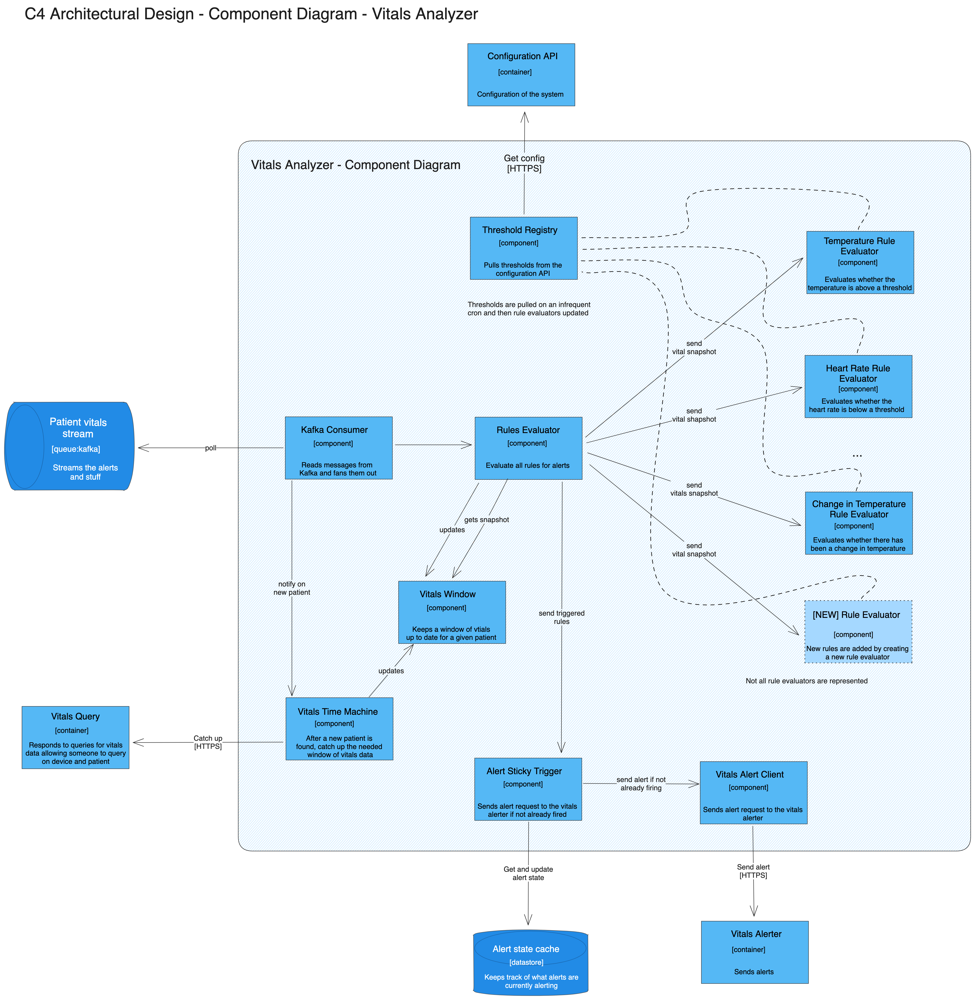

# Vitals Analyzer Deep Dive

The Vitals Analyzer is a service that receives the vitals from the Vitals Reader and analyzes them to determine if the patient needs to be alerted. The Vitals Analyzer receives the vitals from the Vitals Reader through a TCP connection. It also receives the vitals from the Vitals Datastore and from a Kafka topic that contains the vitals. The Vitals Analyzer then sends the alerts to the Vitals Alerter through an HTTP request.

## Flexibility

The component diagram below shows the flexibility of the Vitals Analyzer. It
allows easily changing the thresholds for alerts through the configuration API
and creating new rules by creating a new Rule Evaluator.

